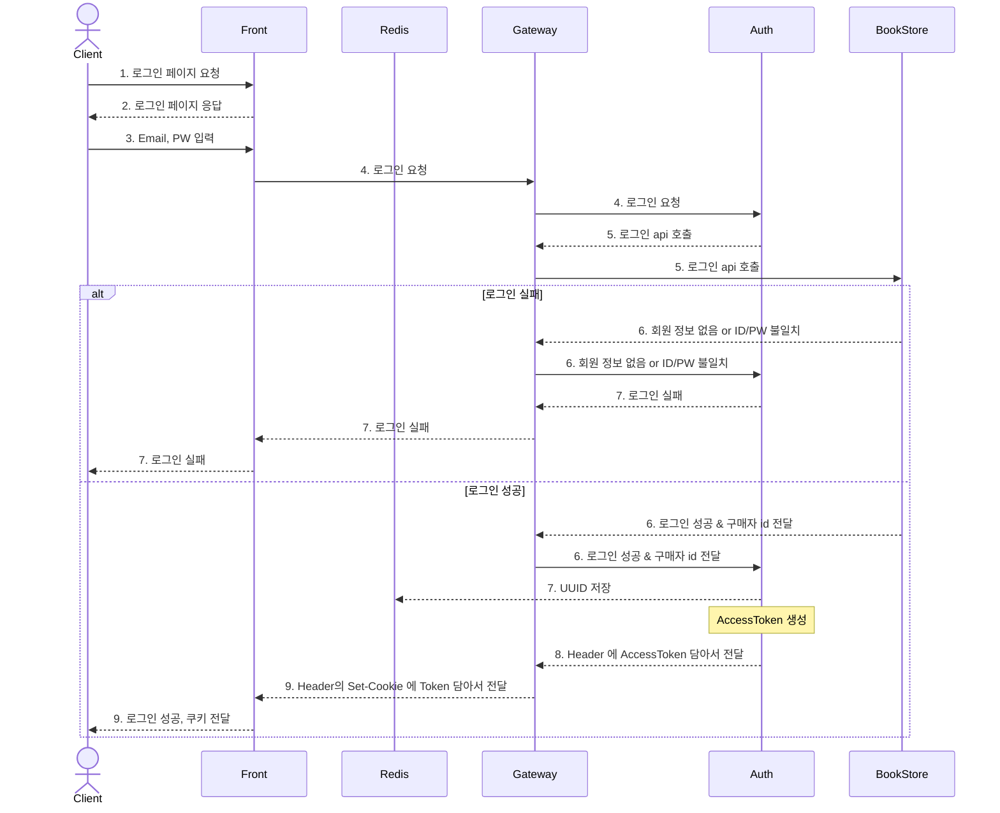
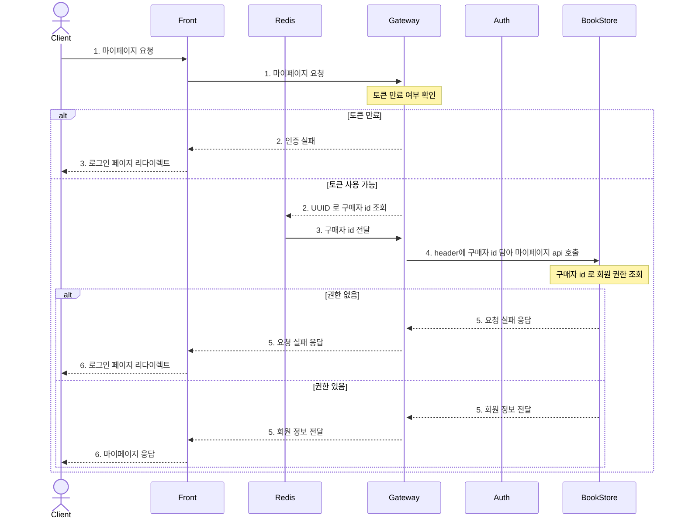
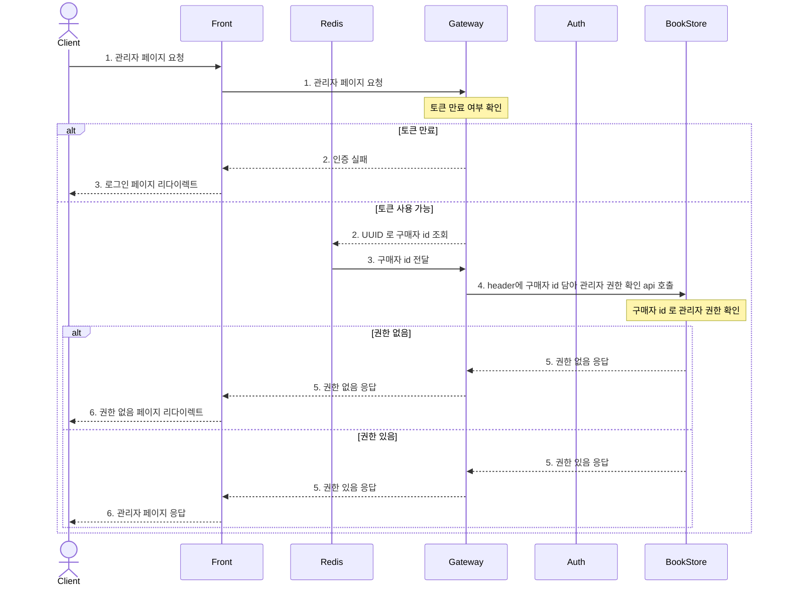

# store99-auth

## Login Sequence

```mermaid

sequenceDiagram

actor c as Client
participant front as Front
participant redis as Redis
participant gateway as Gateway
participant auth as Auth
participant store as BookStore

c->>front: 1. 로그인 페이지 요청
front-->>c: 2. 로그인 페이지 응답
c->>front: 3. Email, PW 입력
front->>gateway: 4. 로그인 요청
gateway->>auth: 4. 로그인 요청
auth-->>gateway: 5. 로그인 api 호출
gateway->>store: 5. 로그인 api 호출
alt 로그인 실패
	store-->>gateway: 6. 회원 정보 없음 or ID/PW 불일치
	gateway->>auth: 6. 회원 정보 없음 or ID/PW 불일치
	auth-->>gateway: 7. 로그인 실패
	gateway-->>front: 7. 로그인 실패
	front-->>c: 7. 로그인 실패
else 로그인 성공
	store-->>gateway: 6. 로그인 성공 & 구매자 id 전달
	gateway->>auth: 6. 로그인 성공 & 구매자 id 전달
	auth-->>redis: 7. UUID 저장
    Note over auth: AccessToken 생성
    auth-->>gateway: 8. Header 에 AccessToken 담아서 전달
    gateway-->>front: 9. Header의 Set-Cookie 에 Token 담아서 전달
    front-->>c: 9. 로그인 성공, 쿠키 전달
end

```

## Authorization Sequence

> 예시 : 마이페이지 요청

```mermaid

sequenceDiagram

actor c as Client
participant front as Front
participant redis as Redis
participant gateway as Gateway
participant auth as Auth
participant store as BookStore

c->>front: 1. 마이페이지 요청
front->>+gateway: 1. 마이페이지 요청
Note over gateway: 토큰 만료 여부 확인
alt 토큰 만료
    gateway-->>front: 2. 인증 실패
    front-->>c: 3. 로그인 페이지 리다이렉트
else 토큰 사용 가능
    gateway-->>redis: 2. UUID 로 구매자 id 조회
    redis->>gateway: 3. 구매자 id 전달
    gateway->>store: 4. header에 구매자 id 담아 마이페이지 api 호출
    Note over store: 구매자 id 로 회원 권한 조회
    alt 권한 없음
        store-->>gateway: 5. 요청 실패 응답
        gateway-->>front: 5. 요청 실패 응답
        front-->>c: 6. 로그인 페이지 리다이렉트
    
    else 권한 있음
        store-->>gateway: 5. 회원 정보 전달
        gateway-->>front: 5. 회원 정보 전달
        front-->>c: 6. 마이페이지 응답
    end
end

```

## Admin Authorization Sequence

```mermaid

sequenceDiagram

actor c as Client
participant front as Front
participant redis as Redis
participant gateway as Gateway
participant auth as Auth
participant store as BookStore

c->>front: 1. 관리자 페이지 요청
front->>gateway: 1. 관리자 페이지 요청
Note over gateway: 토큰 만료 여부 확인
alt 토큰 만료
    gateway-->>front: 2. 인증 실패
    front-->>c: 3. 로그인 페이지 리다이렉트
else 토큰 사용 가능
    gateway-->>redis: 2. UUID 로 구매자 id 조회
    redis->>gateway: 3. 구매자 id 전달
    gateway->>store: 4. header에 구매자 id 담아 관리자 권한 확인 api 호출
    Note over store: 구매자 id 로 관리자 권한 확인
    alt 권한 없음
        store-->>gateway: 5. 권한 없음 응답
        gateway-->>front: 5. 권한 없음 응답
        front-->>c: 6. 권한 없음 페이지 리다이렉트
    
    else 권한 있음
        store-->>gateway: 5. 권한 있음 응답
        gateway-->>front: 5. 권한 있음 응답
        front-->>c: 6. 관리자 페이지 응답
    end
end


```
