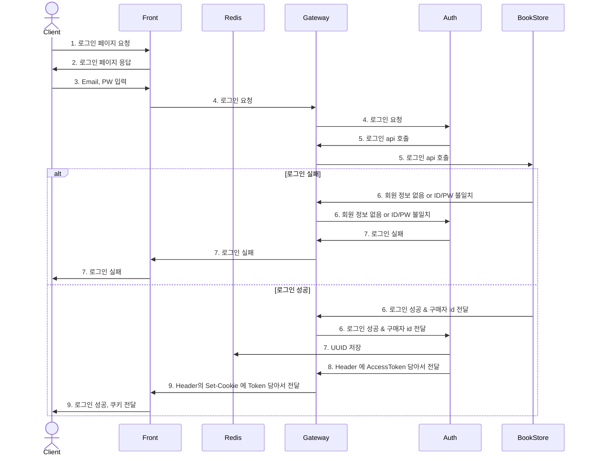

# store99-auth

## Login Sequence

```mermaid

sequenceDiagram

actor c as Client
participant front as Front
participant redis as Redis
participant gateway as Gateway
participant auth as Auth
participant store as BookStore

c->>front: 1. 로그인 페이지 요청
front->>c: 2. 로그인 페이지 응답
c->>front: 3. Email, PW 입력
front->>gateway: 4. 로그인 요청
gateway->>auth: 4. 로그인 요청
auth->>gateway: 5. 로그인 api 호출
gateway->>store: 5. 로그인 api 호출
alt 로그인 실패
	store->>gateway: 6. 회원 정보 없음 or ID/PW 불일치
	gateway->>auth: 6. 회원 정보 없음 or ID/PW 불일치
	auth->>gateway: 7. 로그인 실패
	gateway->>front: 7. 로그인 실패
	front->>c: 7. 로그인 실패
else 로그인 성공
	store->>gateway: 6. 로그인 성공 & 구매자 id 전달
	gateway->>auth: 6. 로그인 성공 & 구매자 id 전달
	auth->>redis: 7. UUID 저장
    auth->>gateway: 8. Header 에 AccessToken 담아서 전달
    gateway->>front: 9. Header의 Set-Cookie 에 Token 담아서 전달
    front->>c: 9. 로그인 성공, 쿠키 전달
end

```
